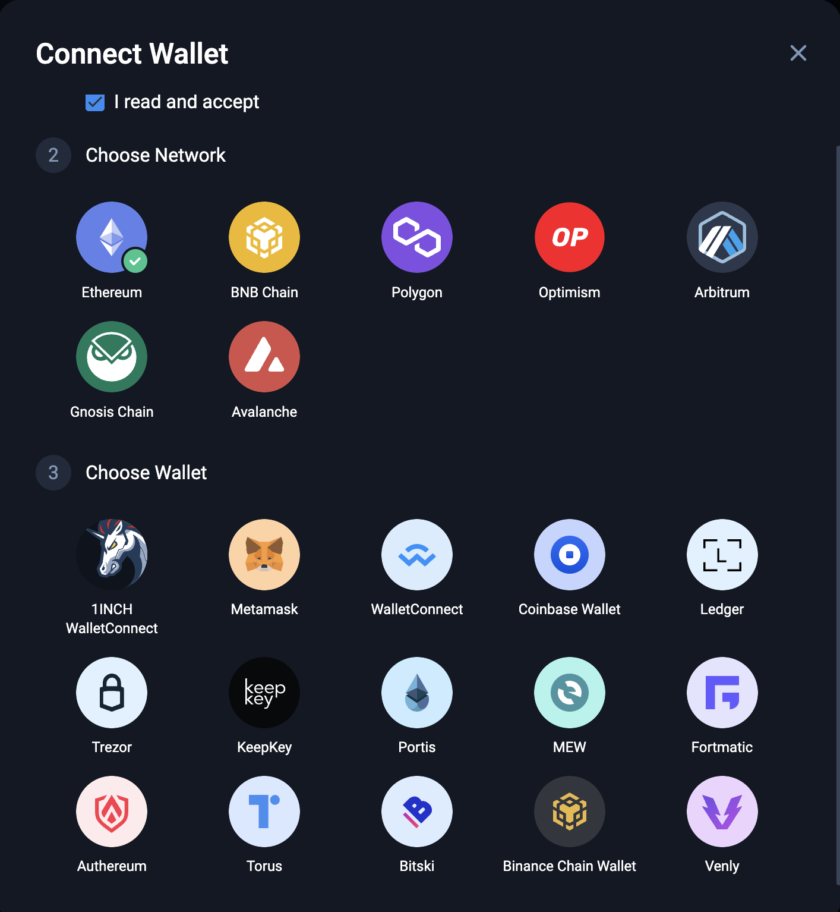

# STL Hiring Homework

## Tools

The following tools MUST be used for this task:

- [Routify](https://routify.dev/), a [Svelte](https://svelte.dev/) frontend framework.
- [Tailwind CSS](https://tailwindcss.com/)
- [Ethers.js](https://docs.ethers.io/v5/)

For others, you can choose as you need.

## Task Description

Please implement a simple web site which can:

- connect to `mainnet` and `polygon` with multiple providers:
  - MetaMask
  - WalletConnect
  - Torus
- show the price trend in 30 minutes:
  - `eth` for `mainnet`
  - `matic` for `polygon`
- show the latest 5 txes histories for each.

The `Connect Wallet` function must be implemented as the following:

Reference: the "Connect Wallet" button of [1inch.io](https://app.1inch.io/).

## Deployment

Using [vercel](https://vercel.com/) for the deployment.

## Deadline

2022-05-13
